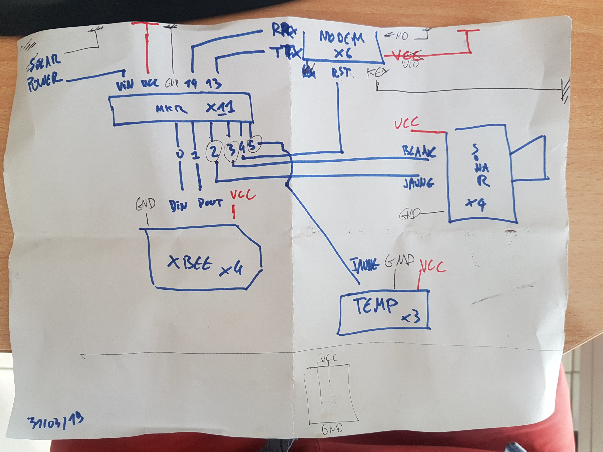
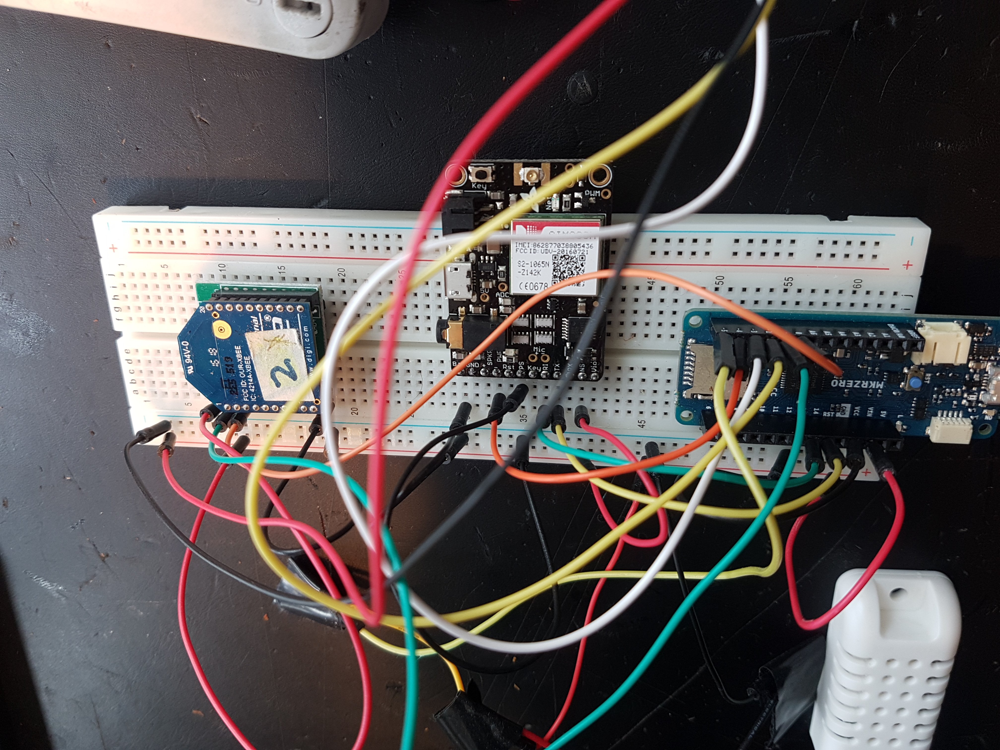
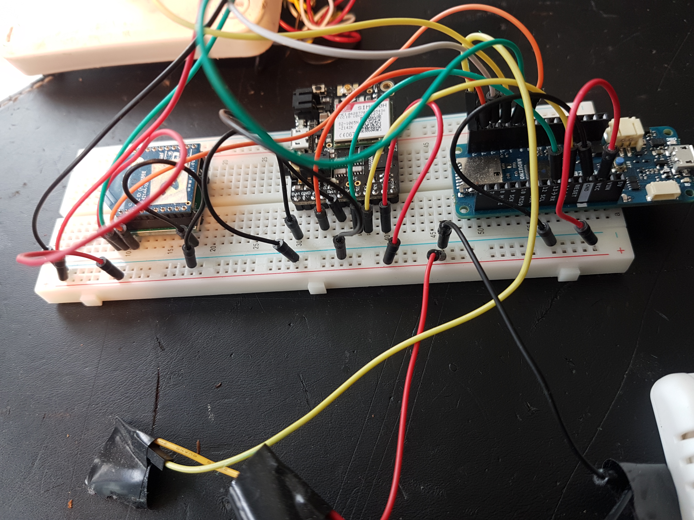
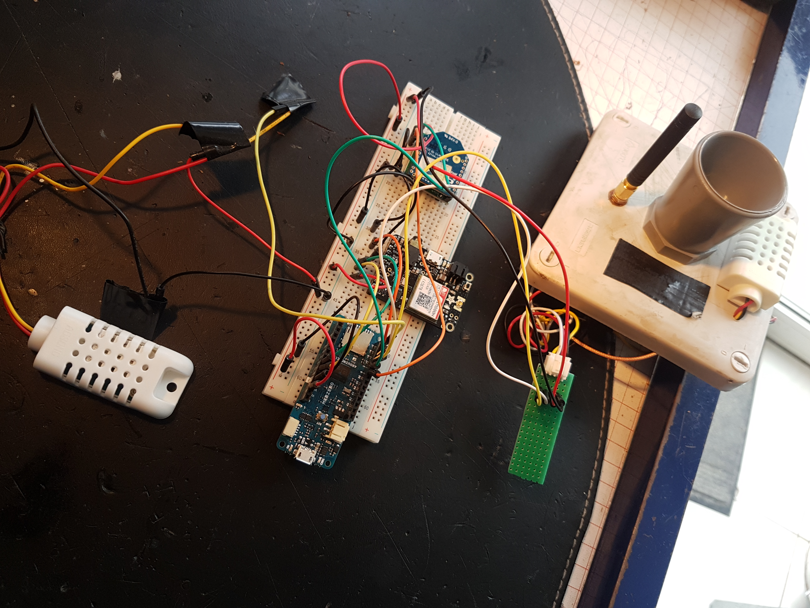

# picolimno-mkr

Télémètre à ultra-sons basé sur le carte Arduino MKRZERO et modem ADAFRUIT  FONA808mini - Mini Cellular GSM Breakout uFL Version (1946)







## Compilation
Après avoir cloner le répertoire, penser à ajouter le fichier
<code>secrets.h</code> qui devra contenir le code suivant :

```
/**
    Water-Level-MKRGSM1400 V1.0 project
    secrets.h
    Purpose: Define secrets for MKRGSM functions and others...
  
    @author Marc SIBERT
    @version 1.0 25/02/2018
    @warning *** This file shouldn't be uploaded in repo (Git) ***
*/
#pragma once

#define PIN_CODE ""

#define APN_NAME ""
#define APN_USERNAME ""
#define APN_PASSWORD ""
```

### Dépendances
* wiring_private
pour ajouter un port série suyr le mkrzero
* RTCZero :
  <code>Croquis > Inclure une biliothèque > RTCZero</code>
* ArduinoJson (https://github.com/bblanchon/ArduinoJson) :
  <code>Croquis > Inclure une biliothèque > Gérer les biliothèques</code> ; Ajouter "ArduinoJSON" dans le filtre et cliquer sur Installer.
* TinyGsmClient : bibliothèque de comande du modem
* ArduinoHttpClient : couche http
* StreamDebugger : pour debug avancé

